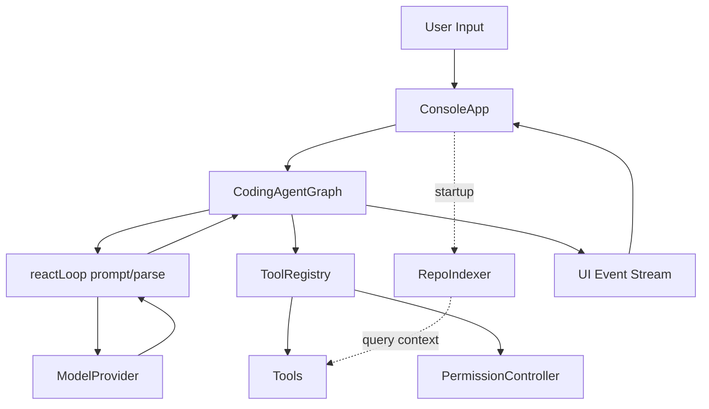

# Nano Codin 项目架构与设计风格报告

## 1. 项目概览

Nano Codin 是一个基于 TypeScript + ESM 的最小化 ReAct 编码代理 CLI。它围绕“在终端里完成代码理解、规划、修改、验证和总结”这一核心路径构建，整体设计明显偏向生产导向的最小可用架构，而不是一个追求插件生态、复杂协作或图形界面的通用 Agent 平台。

项目当前的核心依赖分工清晰：

- `@langchain/langgraph`：负责 Agent 状态图与节点编排。
- `ai` + `@ai-sdk/openai` + `@ai-sdk/anthropic`：负责统一的模型调用与 Provider 适配。
- `Ink` + `React`：负责终端 UI 渲染、输入交互与状态展示。
- `Zod`：负责工具输入 schema 校验，降低 LLM 输出不稳定带来的执行风险。
- `execa`：用于 shell 工具执行外部命令。
- `handlebars`：用于系统提示词与 ReAct 提示模板渲染。

从产品定位看，Nano Codin 不是“会一切”的智能代理，而是一个收敛能力范围、强调执行路径可跟踪、工具接口明确、终端反馈透明的工程化 CLI。这个定位决定了它在架构上选择了少层级、强约束、显式状态和轻量安全门控。

## 2. 目录与模块分层

项目主体围绕 `src/` 构建，辅以 `tests/` 和少量构建脚本。整体更接近“入口装配 + 运行内核 + 横切服务 + 终端壳层”的结构，而不是 MVC。

### 2.1 一级模块职责

- `src/index.ts`
  - CLI 入口与装配层。
  - 负责 `.env` 合并、运行时配置加载、模型 Provider 创建、RepoIndexer 初始化、ToolRegistry 初始化、PermissionController 注入，以及最终挂载 Ink UI。

- `src/agent/`
  - Agent 核心运行内核。
  - `agentGraph.ts` 负责 LangGraph 状态图、节点跳转、阶段预算、验证门控、工具执行衔接、恢复与失败收口。
  - `reactLoop.ts` 负责 ReAct 文本协议的 prompt 构建与输出解析。

- `src/core/`
  - 核心类型和运行时公共能力。
  - 包括消息类型、工具上下文类型、权限控制、运行时配置结构等。

- `src/llm/`
  - 模型路由与 Provider 适配层。
  - 统一对 OpenAI-compatible 和 Anthropic-compatible Provider 的接入与错误包装。

- `src/tools/`
  - 工具层。
  - 包括 `fs`、`edit`、`shell`、`planning` 四类工具，以及统一的 `registry.ts` 注册与执行入口。

- `src/services/`
  - 横切服务层。
  - 包括配置加载、仓库索引、恢复策略、上下文压缩等非 UI、非模型、非工具的基础服务。

- `src/prompts/`
  - Prompt 模板层。
  - `system.hbs` 负责约束规则与工具说明，`react.hbs` 负责注入当前会话、轨迹、阶段和 working memory。

- `src/ui/`
  - 终端表现层。
  - 包括 ConsoleApp、UI reducer、日志展示、权限确认框和输入行为处理。

- `tests/`
  - 测试层。
  - 分为 `unit/`、`integration/`、`smoke/`，覆盖解析、权限、配置、恢复、UI 状态、Agent 图等关键行为。

- `scripts/`
  - 构建辅助脚本。
  - 当前主要是 `copy-prompts.mjs`，用于在构建后将 prompt 模板复制到 `dist/`。

### 2.2 模块关系的设计意图

这个结构的关键特点有三点：

- 入口层不承载业务逻辑，只负责装配依赖。
- Agent 作为运行内核，驱动模型、工具和 UI 事件流，而不是由 UI 直接调度工具。
- 工具、配置、安全、恢复、压缩都被拆成独立模块，便于单独测试和演进。

这意味着项目虽然体量小，但并不是“把逻辑堆在一个 CLI 文件里”的原型结构，而是一个已经具备可维护边界的最小工程化实现。

## 3. 运行架构与数据流

### 3.1 主路径架构图

### 3.2 启动阶段调用链

CLI 启动后的主路径如下：

1. `src/index.ts` 启动进程。
2. 读取当前工作目录下的 `.env`，仅补齐未存在于 `process.env` 的键，不覆盖已有 shell 环境变量。
3. 调用 `loadRuntimeConfig(process.cwd())`，合并 env、`.nanocodin/config.toml`、CLI flags 与 `AGENTS.md` 指南。
4. 调用 `createModelProviderFromEnv()` 创建模型 Provider。
5. 创建 `RepoIndexer`，绑定当前工作目录与仓库索引配置。
6. 创建默认 `ToolRegistry`。
7. 创建 `PermissionController`。
8. 构建 `toolContext`，把 cwd、runtimeConfig、repoIndex、permission、todos、workingMemory 等执行期上下文注入工具层。
9. 异步执行 `repoIndexer.init()` 进行索引加载与增量刷新。
10. 在索引初始化 Promise 的 `finally` 中创建 `CodingAgentGraph` 并挂载 `ConsoleApp`。

这里的一个重要细节是：`RepoIndexer.init()` 采用“异步预热 + 最终挂载”的处理方式。它并没有变成一个单独的常驻后台线程，但它的初始化失败不会阻止 UI 最终渲染，体现出一种偏实用主义的启动容错思路。

### 3.3 任务执行阶段调用链

当用户在终端中输入任务并回车后：

1. `ConsoleApp` 收到输入，构造初始 `messages`。
2. `ConsoleApp` 调用 `graph.run()` 开始一次 Agent 运行。
3. `CodingAgentGraph` 进入 LangGraph 状态图，从 `agent` 节点开始。
4. `agent` 节点调用 `buildAgentMessagesWithContext()` 生成 prompt。
5. `ModelProvider.generate()` 调用底层 LLM。
6. `parseAgentResponse()` 将 LLM 输出解析为 `Thought / Action / Action Input`。
7. 若动作为 `final`，进入终结分支；否则写入 `pending_action`，并跳转到 `tools` 节点。
8. `tools` 节点调用 `ToolRegistry.execute()`。
9. `ToolRegistry` 完成 schema 校验、inline JSON 兼容、权限判断与实际工具执行。
10. 工具结果回写为 `tool` message 与 `intermediate_steps` observation。
11. Agent 再次回到 `agent` 节点，形成 `agent -> tools -> agent` 的循环。
12. 运行过程中的 `thought / action / observation / final / error` 事件会通过 `onEvent` 推送给 UI。
13. `ConsoleApp` 通过 reducer 将事件映射为日志并渲染在终端中。

### 3.4 数据流特征

项目的数据流呈现出几个明显特征：

- 用户输入只进入一次，然后转换为消息流驱动后续状态图。
- LLM 不直接操作文件系统，而是通过 ToolRegistry 间接调用工具。
- UI 不拥有业务逻辑，只消费事件流并渲染状态。
- 工具执行的副作用被包在工具层，Agent 内核主要负责编排和防失控。

## 4. Agent 内核设计

`src/agent/agentGraph.ts` 是整个项目最核心的运行中枢。它不是一个简单的 while-loop，而是把 ReAct 循环包装进 LangGraph 的状态图模型中。

### 4.1 状态字段设计

`CodingAgentGraph` 当前维护的核心状态包括：

- `messages`
  - 当前对话消息流，包含 user、assistant、tool 等角色消息。

- `intermediate_steps`
  - Agent 执行轨迹，记录每一步的 thought、action、observation 和 phase。

- `pending_action`
  - 当前待执行工具调用，在 `agent` 节点决策、`tools` 节点消费。

- `finalAnswer`
  - 最终回答，一旦存在则图进入 `END`。

- `stepCount`
  - 当前步数计数，用于 max step 终止条件。

- `phase`
  - 当前运行阶段，取值为 `discover | plan | execute | verify | finalize`。

- `phaseVisits`
  - 各阶段访问次数，用于 phase budget 控制。

- `requiresVerify`
  - 根据用户输入关键词判断这次任务是否必须经过验证步骤。

- `hasVerified`
  - 本轮运行是否已经成功执行过验证动作。

- `stepRecoveryCount`
  - 当前步骤已尝试恢复的次数。

- `recoverySignatures`
  - 恢复尝试签名，用于去重，避免重复 fallback。

- `recoveryHistory`
  - 恢复历史记录，用于最终失败总结和调试。

这些字段说明项目并没有把 Agent 只看成“模型输出 + 工具执行”的裸循环，而是把它当作一个需要阶段控制、预算控制、恢复控制和验证控制的有限状态机。

### 4.2 图结构

状态图结构非常收敛：

- `START -> agent`
- `agent -> tools` 或 `agent -> END`
- `tools -> agent`

因此它本质上是一个双节点循环：

- `agent` 节点负责思考与决定下一步动作。
- `tools` 节点负责执行动作并生成 observation。

这种设计的优点是结构清晰、调试简单、事件语义稳定，也方便把恢复、验证、阶段预算等逻辑集中插入到两个关键节点中。

### 4.3 Phase-aware 设计

项目当前把运行过程拆分为五个阶段：

- `discover`
  - 适合索引查询、目录查看、初步理解仓库。

- `plan`
  - 适合生成 todo 计划，尤其是在需要修改文件之前。

- `execute`
  - 适合查看具体文件、编辑文件、执行非验证类命令。

- `verify`
  - 适合执行测试、lint、typecheck、build 等验证动作。

- `finalize`
  - 用于输出最终答案。

阶段的判定主要由 `inferPhase()` 完成，例如：

- `todo.create_todo_list` 会进入 `plan`。
- `repo_index_query / tree / ls` 初期更偏 `discover`。
- `bash` 中带有 `test|lint|typecheck|build` 的命令会进入 `verify`。
- 变更类工具通常进入 `execute`。

这套 phase-aware 设计并不复杂，但足够表达“先理解、再规划、再执行、再验证、最后收口”的工程性节奏。

### 4.4 防失控机制

为了避免 Agent 失控，项目加入了多层约束：

- `maxSteps`
  - 总步数上限，超限后输出失败总结，而不是无限循环。

- `phase budget`
  - `discover`、`plan`、`execute + verify` 分别有访问上限。
  - 一旦某一阶段超过预算，直接停止并输出原因。

- `verify guard`
  - 当用户任务文本命中 `fix / bug / implement / refactor / 测试 / 修复 / 实现` 等关键词时，若未成功执行验证动作，Agent 不能直接 `final`。

- `plan gate`
  - 对 `create / insert / str_replace` 这类修改类工具，要求先创建 1-3 项 todo；否则会被拦回 `plan` 阶段。

- `recovery`
  - 工具失败后尝试单步恢复，避免因轻微 schema 问题或命令不可用而整个任务立刻中止。

- `compression`
  - 当上下文过长时压缩历史轨迹，并抽取 working memory，降低 prompt 失控和 token 膨胀风险。

这些机制组合起来，构成了一个很典型的“轻量但明确”的 Agent 风险控制框架。

## 5. Tool 与安全机制

### 5.1 ToolRegistry 的职责

`src/tools/registry.ts` 是工具层的统一入口，主要承担以下职责：

- 注册所有工具并维护 name -> tool 的映射。
- 为 prompt 输出统一的工具描述列表。
- 在执行前按 Zod schema 校验输入。
- 兼容 `Action: toolName {json}` 这种 inline JSON 格式。
- 在真正执行前接入权限判断。
- 将执行结果统一返回为 `ToolResult`。

这使得 Agent 内核不需要关心每个工具的具体输入校验和权限策略，最大限度降低了编排层复杂度。

### 5.2 工具分组

当前工具按职责大致可分为四类：

- `fs`
  - `ls`
  - `tree`
  - `grep`
  - `repo_index_query`
  - 作用是查看目录、搜索文本、利用预生成索引理解仓库。

- `edit`
  - `view`
  - `create`
  - `insert`
  - `str_replace`
  - 作用是查看、创建和修改文件。

- `shell`
  - `bash`
  - 作用是执行命令，适合验证、辅助诊断和更灵活的仓库操作。

- `planning`
  - `todo`
  - 作用是创建和维护简单任务计划，配合 plan gate 使用。

### 5.3 Prompt 对工具使用的约束

提示词层对工具使用加入了明确行为约束：

- 优先使用 `repo_index_query`，而不是一开始做大范围文件扫描。
- 在修改文件前，必须先通过 `todo` 创建不超过 3 项的计划。
- 每次只允许一个 action，降低复杂工具链调用的解析不确定性。

这些规则反映出项目对“稳定、可控、可解析”的优先级高于“自由、智能、一步到位”。

### 5.4 安全模型

当前安全模型可以概括为“轻量策略控制 + 显式用户确认”，而不是操作系统级沙箱。

其关键机制包括：

- `sandbox.defaultPolicy`
  - 支持 `allow | ask | deny`。

- `allowPrefixes`
  - 明确哪些命令前缀默认允许，例如 `ls`、`cat`、`rg`、`npm run typecheck`、`npm run build`。

- `askPrefixes`
  - 明确哪些命令前缀需要用户确认，例如 `git commit`、`git push`、`npm install`、`curl`、`ssh`。

- `denyPatterns`
  - 显式拦截高风险命令模式，例如 `rm -rf /`、`shutdown`、`mkfs`、`dd if=`。

- `PermissionController`
  - 为 `bash` 以及修改类工具提供二次确认能力。

- UI 权限弹窗
  - 当执行需要确认的工具时，终端中显示权限提示框，用户可以通过 `y / a / n` 完成授权决策。

需要强调的是，这并不是容器级、进程级、文件系统级隔离方案，而是一种面向 CLI 场景的轻量风险缓解机制。它能减少明显误操作，但不能替代真正的系统安全边界。

## 6. 配置、索引、恢复、压缩

### 6.1 配置优先级与来源

项目运行时配置由多个来源组合而成，优先级如下：

- CLI flags
- `.nanocodin/config.toml`
- `AGENTS.md`
- env
- defaults

其中：

- env 主要负责模型 Provider、API Key、部分 Agent 参数。
- `.nanocodin/config.toml` 负责 agent、sandbox、repo index、recovery、compression 等结构化配置。
- `AGENTS.md` 不直接承载结构化配置，但会被解析为 guideline 列表并注入 system prompt。
- defaults 定义在 `src/core/runtimeConfig.ts` 中，作为最终兜底。

### 6.2 AGENTS.md 的角色

`loadRuntimeConfig()` 会读取当前工作目录下的 `AGENTS.md`，并通过 `parseAgentsGuidelines()` 逐行抽取可用规则：

- 忽略标题和代码块。
- 读取普通文本和列表项。
- 最多保留 40 条 guideline。

这些 guideline 最终会出现在 `system.hbs` 的“Project AGENTS guidelines”区域，成为对 Agent 行为的软约束。这个设计让项目具备了轻量的“项目个性化控制”能力。

### 6.3 RepoIndexer

`src/services/repoIndexer.ts` 提供了一个偏实用主义的仓库理解机制，其核心流程包括：

- 遍历工作目录下的文本文件。
- 根据扩展名筛选可索引文件。
- 抽取文件中的 top symbols。
- 抽取 import / require 依赖。
- 自动生成简短 summary。
- 将结果持久化到 `.nanocodin/index.json`。
- 支持按 `pathPrefix`、`symbol`、`keyword` 查询。
- 通过 `maxBytes` 和路径优先级策略裁剪索引体积。

它不是 AST 级分析器，也不追求完美语义理解，但对于“快速回答某个模块在哪、某个关键字出现在哪、哪个文件看起来重要”这类问题已经足够有效。

### 6.4 RecoveryEngine

`src/services/recoveryEngine.ts` 是一个单步恢复引擎，用于处理常见工具执行失败。

当前可处理的典型情形包括：

- 输入 schema 错误时，尝试归一化字段。
- `todo` 输入不规范时，尝试补全为 `create_todo_list` 形式。
- `bash: rg: command not found` 时，回退为 `grep -R`。
- `fd` 不可用时回退到 `find . -name`。
- `bat` 不可用时回退到 `cat`。
- `npm test` 缺少脚本时，尝试回退到 `npm run typecheck`。

其边界同样明确：

- 每步最多恢复 `maxRetryPerStep` 次。
- 通过 `recoverySignatures` 防止短窗口内重复恢复。
- 如果无法安全推断替代动作，则直接放弃恢复，而不是盲目重试。

### 6.5 CompressionManager

`src/services/compressionManager.ts` 负责上下文压缩，其思路是：

- 估算当前消息和轨迹的 token 消耗。
- 当估算值超过 `contextTokenBudget * tokenThresholdRatio` 时，触发压缩。
- 保留最近若干步完整轨迹。
- 对较旧步骤提炼为 `workingMemory`。
- 对较长 observation 进行头尾保留与错误行优先保留。

生成的 working memory 主要包含：

- 当前目标 `goal`
- 已做决策 `decisions`
- 触达文件 `touchedFiles`
- 开放问题 `openIssues`
- 下一步建议 `nextAction`

这是一种典型的“结构化摘要替代原始上下文”策略，适合小型 Agent CLI 持续扩展而不至于 prompt 失控。

## 7. 终端 UI 设计风格报告

### 7.1 总体风格判断

Nano Codin 的 UI 明显不是视觉导向产品，而是一个强调高密度信息、低装饰表达、强状态反馈的终端工程工具。它的设计重点不在“惊艳”，而在“用户随时知道系统正在做什么、下一步会发生什么、哪些动作需要自己确认”。

因此，这套风格更适合被概括为：

- 极简工程工具感
- 过程可见
- 结果导向
- 谨慎而不过度阻塞

### 7.2 品牌识别

UI 层的品牌表达非常克制，但并非完全没有视觉识别：

- 顶部使用固定 ASCII Banner 展示产品名。
- `BRAND_COLOR` 采用亮蓝色 `#38bdf8`。
- 最终回答和输入边框复用品牌色，形成统一的视觉主轴。

这种设计既保留了终端工具应有的轻量感，又给产品留下了足够明确的品牌记忆点。

### 7.3 交互节奏

当前终端交互节奏有几个明显特征：

- 输入即执行，用户不需要切换模式。
- 单任务聚焦，一次只处理一个活跃请求。
- 忙碌态下普通输入被锁定，避免状态污染。
- `ESC` 可以取消当前任务。
- 双击 `Ctrl+C` 才退出，减少误触退出。

这种节奏体现出终端工具常见的“保持快，但不鲁莽”的设计取向。

### 7.4 信息层级

UI 中的日志被明确区分为多个语义层级：

- `user`
- `thought`
- `loading`
- `action`
- `observation`
- `final`
- `error`
- `meta`

每类日志都有独立前缀、颜色与展示方式。例如：

- `thought` 与 `loading` 使用动态点动画制造运行中反馈。
- `action` 明确标识调用的工具和输入。
- `observation` 对长输出做摘要折叠。
- `final` 使用品牌色强化完成态。
- `error` 使用红色快速建立风险感知。

这使得用户即使不理解内部实现，也能通过日志层级快速感知系统阶段和风险点。

### 7.5 渐进披露

`observation` 默认采用折叠展示，只显示摘要和隐藏行数；必要时用户可通过 `Ctrl+E` 展开最新输出。这个设计很重要，因为它在终端有限空间里解决了一个常见冲突：

- 工具输出往往很长。
- 但大部分时候用户只需要先看第一行结论。

因此，Nano Codin 并没有把“完整输出”直接淹没在主视图里，而是采用渐进披露策略，兼顾了信息密度与可读性。

### 7.6 安全提示风格

权限确认框采用边框盒模型和黄色强调色，信息布局也相当直接：

- 明确写出 `Permission required`
- 显示工具名
- 显示命令或目标路径
- 提示 `y / a / n` 三种选择

这种设计风格并不追求柔和，而是明确让用户意识到“接下来是一个需要承担后果的动作”。这与工程工具的语境高度一致。

### 7.7 情绪基调

整个 UI 的情绪基调可以概括为：

- 克制
- 可靠
- 工程化
- 不拟人化

它几乎不使用情绪化文案，也不会把 Agent 表现成聊天伙伴。相反，它通过稳定的日志格式、确定的提示文案和清晰的权限交互建立信任。这种气质对于代码代理 CLI 是合适的。

### 7.8 可用性与局限

当前 UI 在可用性上已经覆盖了终端工具的关键操作：

- 常驻 hint 文案
- 取消能力
- 安全确认
- 输出折叠
- 退出防误触
- 光标可移动输入
- Home/End、Delete/Backspace 等兼容处理

但它也存在明显局限：

- 色彩体系单一，视觉分组依赖文本而不是布局层次。
- 长时会话的历史管理能力有限，只保留最近 40 条日志渲染。
- 没有多任务、多面板、多会话视图。
- observation 折叠是单点优化，尚未形成更系统的信息架构。

## 8. Prompt 与行为设计

### 8.1 模板分工

项目当前有两个核心 prompt 模板：

- `system.hbs`
  - 负责定义 Agent 角色、工具列表、AGENTS 指南和硬性输出规则。

- `react.hbs`
  - 负责注入本轮会话上下文，包括 conversation、current phase、working memory 和 previous steps。

这是一种清晰的“稳定规则层 + 动态上下文层”分离方式，便于维护和演进。

### 8.2 输出协议

系统提示词强制模型输出固定协议：

- `Thought: <...>`
- `Action: <tool name or final>`
- `Action Input: <valid JSON object>`

项目还允许 `Action` 字段内嵌 JSON，例如：

- `Action: bash {"command":"npm run typecheck"}`

但总体上仍坚持“一次只做一个 action”的严格格式。这种协议化设计非常适合终端 Agent，因为它能最大程度降低解析歧义和 tool-call 失败率。

### 8.3 Prompt 对行为的显式控制

当前 prompt 明确控制了几个关键行为：

- 一次只允许一个 action。
- 任务完成后才能使用 `final`。
- 修改前先创建 todo 计划。
- 探索时优先 `repo_index_query`，避免无边界扫描。
- 不能省略 `Thought / Action / Action Input` 三个字段。

这说明项目不是把“智能”完全交给模型自由发挥，而是用 prompt 把模型锁进一个可预测、可恢复、可校验的操作协议里。

## 9. 测试与质量保障

### 9.1 测试分层

项目当前测试结构分为三层：

- `tests/unit/`
  - 单元测试，关注纯逻辑和局部行为。

- `tests/integration/`
  - 集成测试，关注模块协作，例如 Agent 图与 ToolRegistry、配置加载等。

- `tests/smoke/`
  - 冒烟测试，验证入口级行为和基础可运行性。

### 9.2 当前已覆盖的关键点

从现有测试可以看到，项目对以下能力已经有明确覆盖：

- response parsing
  - `parseAgentResponse()` 的标准格式解析、inline JSON、异常输入回退。

- tool registry 执行与权限
  - 未知工具、schema 校验、inline payload、权限拒绝与允许分支。

- config loader
  - TOML 解析、配置应用、优先级合并。

- recovery
  - todo 归一化、命令 fallback、去重、禁用恢复、无效恢复等。

- console state / input
  - UI reducer、折叠日志、输入编辑、Home/End、Delete/Backspace 兼容等。

- graph / tool registry integration
  - 验证门控、工具图执行协同等。

整体来看，测试覆盖虽然不算庞大，但明显围绕“最容易失稳的点”展开，而不是平均撒网。

### 9.3 构建与验证命令

项目 README 中定义的主要验证命令包括：

- `npm run test`
- `npm run typecheck`
- `npm run build`

其中：

- `typecheck` 使用 `tsc --noEmit`
- `build` 使用 `tsc -p tsconfig.json && node scripts/copy-prompts.mjs`
- `verify` 组合执行 typecheck、test 和 coverage

这套链路与项目定位一致，强调的是“小而清晰的发布验证路径”。

## 10. 架构评估与演进建议

### 10.1 优势

当前架构最明显的优势有四类：

- 小而完整
  - 虽然代码量不大，但从配置、索引、Prompt、工具、Agent、UI、恢复到测试的主链条已经闭合。

- 模块边界清晰
  - 入口、运行内核、工具、横切服务和 UI 的职责划分比较自然，后续扩展不会立刻引发大规模耦合。

- 运行链路可跟踪
  - Thought、Action、Observation、Final 都有显式事件和 UI 显示，定位问题成本较低。

- 安全 / 恢复 / 压缩具备雏形
  - 即使当前实现仍然轻量，但已经覆盖了 Agent CLI 最常见的失控点。

### 10.2 风险

当前架构的主要风险也比较明确：

- 单 Agent、单线程能力上限明显
  - 当前结构适合单任务串行处理，不适合复杂并行编排或多代理协作。

- Prompt 协议脆弱性仍然存在
  - 尽管格式被严格约束，但 ReAct 文本协议仍然依赖模型稳定输出，天然存在脆弱性。

- 工具权限粒度较粗
  - 当前安全模型更多依赖前缀、模式和用户确认，尚未达到更细粒度的资源级权限控制。

- 索引质量受静态启发式限制
  - RepoIndexer 并不是语义索引，复杂项目中的召回质量和重要性排序仍有上限。

- UI 信息架构仍偏线性
  - 当前终端表现足够清晰，但在长任务、复杂验证输出、多任务场景下容易接近信息承载上限。

### 10.3 建议

如果后续继续演进，这个项目最值得优先加强的方向包括：

- 更强的 tool/action schema robustness
  - 可以进一步减少自由文本解析，增强结构化调用与错误恢复能力。

- 更细粒度权限策略
  - 不只按命令前缀判断，还可逐步引入基于路径、命令类别、风险级别的细分策略。

- richer UI information architecture
  - 可以考虑更清晰的阶段分区、可折叠任务段、验证结果摘要卡片或更强的历史检索能力。

- 更系统的 observability / telemetry / benchmark
  - 当前已有 LangSmith tracing 接口，但还可以进一步建立更系统的运行指标、错误画像和任务基准。

## 11. 结论

Nano Codin 的架构成熟度，已经超过“最小玩具 Agent CLI”，但仍刻意保留了小体量和低复杂度。它的设计重点不是把所有高级能力一次性做满，而是先把最核心的执行路径做清楚：

- 能理解仓库
- 能规划动作
- 能调用工具
- 能受控修改
- 能做验证
- 能在终端中把过程讲清楚

从架构上看，它已经具备继续扩展的基础；从设计风格上看，它选择的是一种非常清楚的工程工具气质：克制、透明、直接、可控。对于一个面向编码任务的终端代理来说，这种取向是合理且有辨识度的。
